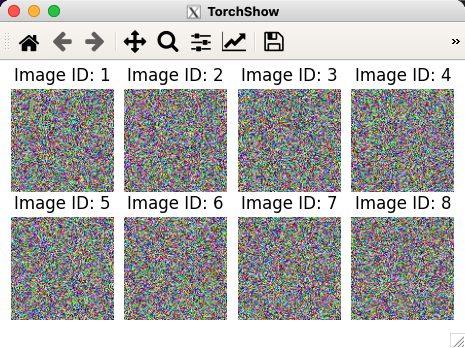

# TorchShow API References

## torchshow.show

```python
torchshow.show(x, display=True, nrows=None, ncols=None, channel_mode='auto', show_axis=False, tight_layout=True, suptitle=None, axes_title=None, figsize=None, dpi=None)
```

### Parameters:

* **x**: *tensor-like (support both `torch.Tensor` and `np.ndarray`) or List of tensor-like.* The tensor data that we want to visualize.

* **display**: *bool*. If set to false, TorchShow will not display the data but return the list of processed data. Use it when you want to visualize them using other libraries such as OpenCV.

* **nrows**: *Int*. The number of rows to plot in a grid layout. If not specified it will be automatically inferred by TorchShow.

* **ncols**: *Int*. The number of columns to plot in a grid layout. If not specified it will be automatically inferred by TorchShow.

* **channel_mode**: *Str*. The channel mode of your input data. Available options are `"auto"`, `"channel_last"` and `"channel_fist"`. The default value is `"auto"` and it will be automatically inferred by TorchShow.

* **show_axis**: *Bool*. Whether to show the axis in the plot.

* **tight_layout**: *Bool*. Routines to adjust subplot params so that subplots are nicely fit in the figure. Corresponding to `fig.tight_layout()` in matplotlib.

* **suptitle**: *Str*. Add a centered suptitle to the figure.

* **axes_title**: *Str*. Add titles to each of the axes. It can be used with predefined placeholders. Available placeholders are: `{img_id}`, `{img_id_from_1}`, `{row}`, `{column}`. Below is an example that shows the image id on top of each image:

    ```python
    batch = torch.rand(8, 3, 100, 100)
    ts.show(batch, axes_title="Image ID: {img_id_from_1}")
    ```

    

* **figsize**: *2-tuple of floats*. Figure dimension `(width, height)` in inches.

* **dpi**: *float* Dots per inch.

---

## torchshow.save

```python
torchshow.save(x,
               path=None,
               **kwargs)
```

### Parameters:

* **x**: *tensor-like (support both `torch.Tensor` and `np.ndarray`) or List of tensor-like.* The tensor data that we want to visualize.
* **path**: *str*. The path to save the figure.
* **kwargs**: You can pass in any other parameters available in `torchshow.show().`

---

## torchshow.show_video

```python
torchshow.show_video(x,
                     display=True,
                     show_axis=False,
                     tight_layout=False,
                     suptitle=None,
                     figsize=None,
                     dpi=None)
```

* **x**: *tensor-like (support both `torch.Tensor` and `np.ndarray`) or List of tensor-like.* The tensor data that we want to visualize.

* **display**: *bool*. If set to false, TorchShow will not display the data but return the list of processed data. Use it when you want to visualize them using other libraries such as OpenCV.

* **show_axis**: *Bool*. Whether to show the axis in the plot.

* **tight_layout**: *Bool*. Routines to adjust subplot params so that subplots are nicely fit in the figure. Corresponding to `fig.tight_layout()` in matplotlib.

* **suptitle**: *Str*. Add a centered suptitle to the figure.

* **figsize**: *2-tuple of floats*. Figure dimension `(width, height)` in inches.

* **dpi**: *float* Dots per inch.