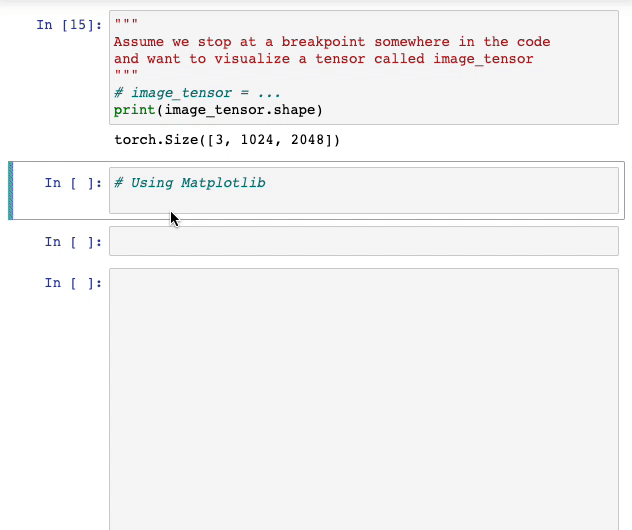
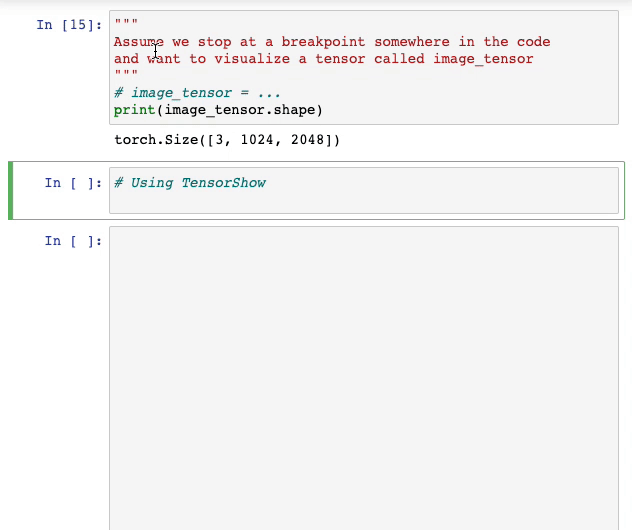
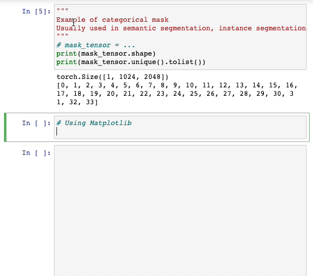
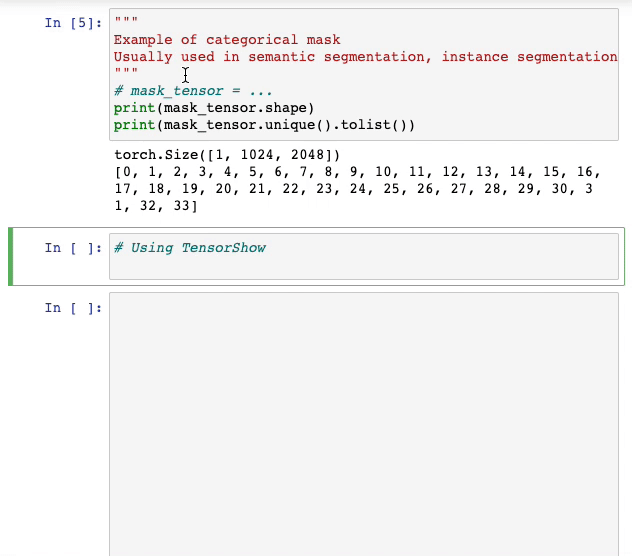
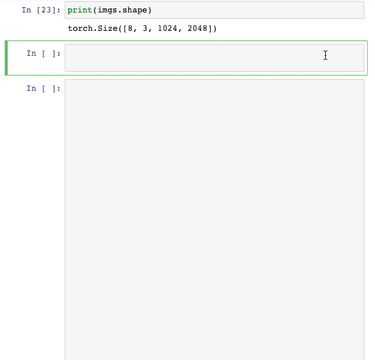
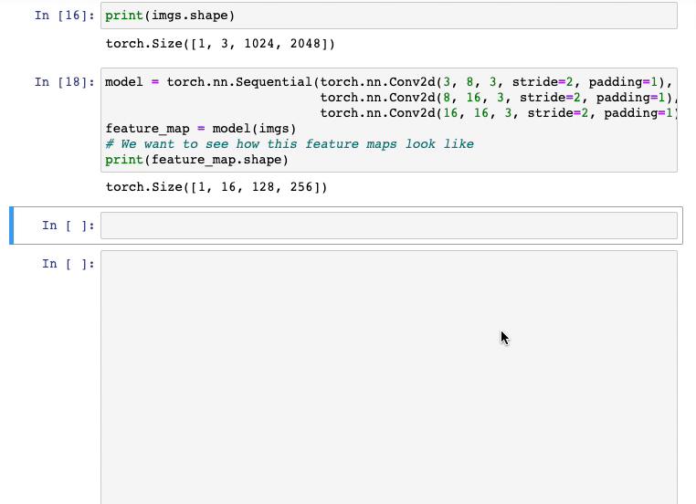
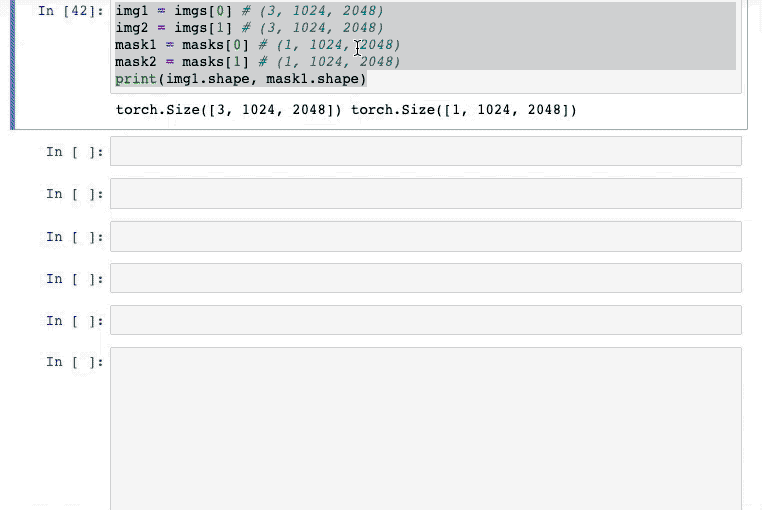
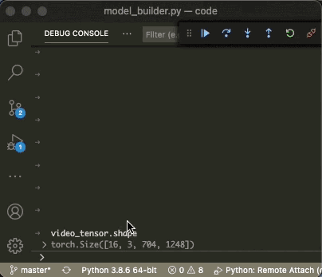
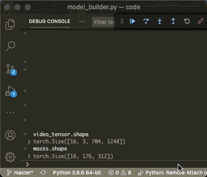

# TorchShow

Torchshow visualizes your data in one line of code. It is designed to help debugging Computer Vision project.

Torchshow automatically infers the type of a tensor such as RGB images, grayscale images, binary masks, categorical masks (automatically apply color palette), etc. and perform necessary unnormalization if needed. 

**Supported Type:**

- [x] RGB Images
- [x] Grayscale Images
- [x] Binary Mask
- [x] Categorical Mask (Integer Labels)
- [x] Multiple Images
- [x] Videos
- [x] Multiple Videos
- [ ] Optical Flows

`Note: The package is still under development and may have bugs.`

## Installation

```bash
git clone https://github.com/xwying/torchshow.git
cd torchshow
pip install .
```

- TODO: support installation via pip.

## Basic Usage

```python
import torchshow as ts
ts.show(tensor)
```

## Examples

### Table of Contents
- [Visualizing Image Tensor](#1-visualizing-image-tensor)
- [Visualizing Mask Tensors](#2-visualizing-mask-tensors)
- [Visualizing Batch of Tensors](#3-visualizing-batch-of-tensors)
- [Visualizing Channels in Feature Maps](#4-visualizing-feature-maps)
- [Visualizing Multiple Tensors with Custom Layout.](#5-visualizing-multiple-tensors-with-custom-layout)
- [Visualizing Tensors as Video Clip](#6-visualizing-tensors-as-video-clip)
- [Display Video Animation in Jupyter Notebook](#7-display-video-animation-in-jupyter-notebook)
- [Set Inline Display in Notebook](#8-set-inline-display-in-notebook)
- [Change Channel Order (RGB/BGR)](#9-change-channel-order-rgbbgr)
- [Change Unnormalization Presets](#10-change-unnormalization-presets)

### 1. Visualizing Image Tensor
Visualizing an image-like tensor is not difficult but could be very tedious. You usually need to convert the tensor to numpy array with proper shapes. In many cases images were normalized during dataloader, which means that you have to unnormalize it so it can be displayed correctly.

If you need to frequently verify how your image tensors look like, TorchShow is a very helpful tool. 

Using Matplotlib             |  Using TorchShow
:-------------------------:|:-------------------------:
  |  
|The image tensor has been normalized so Matlotlib cannot display it correctly. | TorchShow does the conversion automatically.|

### 2. Visualizing Mask Tensors
For projects related to Semantic Segmentation or Instance Segmentation, we often need to visualize mask tensors -- either ground truth annotations or model's prediction. This can be easily done using TorchShow.

Using Matplotlib             |  Using TorchShow
:-------------------------:|:-------------------------:
  |  
|The default color can hardly differentiate categories or instances. | TorchShow automatically apply color palletes during visualization.|

### 3. Visualizing Batch of Tensors
When the tensor is a batch of images, TorchShow will automatically create grid layout to visualize them. It is also possible to manually control the number of rows and columns.



### 4. Visualizing Feature Maps
If the input tensor has more than 3 channels, TorchShow will visualize each of the channel similar to batch visualization. This is useful to visualize a feature map.



### 5. Visualizing Multiple Tensors with Custom Layout.
TorchShow has more flexibility to visualize multiple tensor using a custom layout.

To control the layout, put the tensors in list of list as an 2D array. The following example will create a 2 x 3 grid layout.

```
ts.show([[tensor1, tensor2, tensor3],
         [tensor4, tensor5, tensor6]])
```

It is worth mentioning that it is necessary to fill up all the places in the grid. The following example visualizes 5 tensors in a 2 x 3 grid layout.

```
ts.show([[tensor1, tensor2],
         [tensor3, tensor4, tensor5]])
```



### 6. Visualizing Tensors as Video Clip
Tensors can be visualized as video clips, which very helpful if the tensor is a sequence of frames. This can be done using `show_video` function.

```python
ts.show_video(video_tensor)
```



It is also possible to visualize multiple videos in a custom grid layout.



### 7. Display Video Animation in Jupyter Notebook
TorchShow visualizes video clips as an `matplotlib.func_animation` object and may not display in a notebook by default. The following example shows a simple trick to display it.

```python
import torchshow as ts
from IPython.display import HTML

ani = ts.show_video(video_tensor)
HTML(ani.to_jshtml())
```

### 8. Set Inline Display in Notebook
By default the ts.show() will call `plt.imshow()` followed by `plt.show()` to display the result. When using notebook environment with `%inline` display enabled. Running the following code will tell torchshow to not run `plt.show()`.

```python
import torchshow as ts
ts.use_inline(True)
```
### 9. Change Channel Order (RGB/BGR)
By default tensorflow visualize image tensor in the RGB mode, you can switch the setting to BGR in case you are using opencv to load the image.
```python
ts.set_color_mode('bgr)
```

### 10. Change Unnormalization Presets
The image tensor may have been preprocessed with a normalization function. If not specified, torchshow will automatically rescale it to 0-1. 


To change the preset to imagenet normalization. Use the following code.
```python
ts.show(tensor, unnormalize='imagenet')
```

To use a customize mean and std value, use the following command. 
```python
ts.set_image_mean([0., 0., 0.])
ts.set_image_std([1., 1., 1.])
```
Note that once this is set, torchshow will use this value for the following visualization. This is useful because usually only a single normalization preset will be used for the entire project.